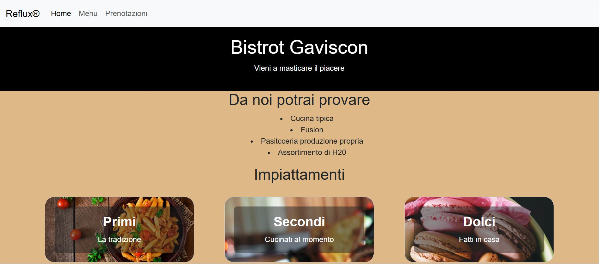
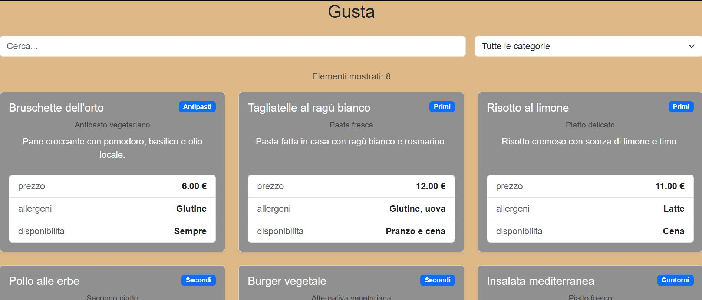

# Progetto Menu Ristorante

Questa repository serve a creare una pagina statica che utilizza uno script Json in locale utile ad impstare il menu di un ristorante e le prenotazioni.

Il progetto è un esempio di sito statico.

## Funzionalità

Il progetto dispone di queste funzionalità:

- sito statico con multipagina
- homepage che riassume il sito
- pagina menu che mostra cosa offre il ristorante e gli allergeni
- pagina prenotazioni
- integra un design responsive per anche dispositivi mobile

## Tecnologie utilizzate

- html
- css & bootstrap (per il design e la responsività)
- javascript (per fetchare i dati delle api)


## Requisiti

- un browser moderno
- connessione attiva a internet per Bootstrap e per fetchare
- git o github per clonare la repository

## API utilizzate

Nel progello, l'API è simulata dal locale:

```text
data.json
```

## Struttura

Il sito è organizzato così:

```
nome-progetto/
├── README.md
├── index.html
├── menu.html
├── prenotazioni.html
├── style.css
├── script.js
├── data.json
├── docs/
│   ├── installazione.md
│   ├── faq.md
│   └── api.md
└── assets/
    └── immagini/
```

## LICENSE

Il progetto utilizza una licenza MIT. Per info cliccare qui: [LICENZA](/LICENSE)

La licenza MIT perché è una licenza che permette a chiunque di usare, modificare e distribuire questo progetto liberamente.
Essendo permissiva, è adatta a progetti didattici e open‑source poiché non impone particolari restrizioni e rende semplie la condivisione del codice per scopi didattici.


## Sreenshot

Ecco alcuni screenshot della pagina:



